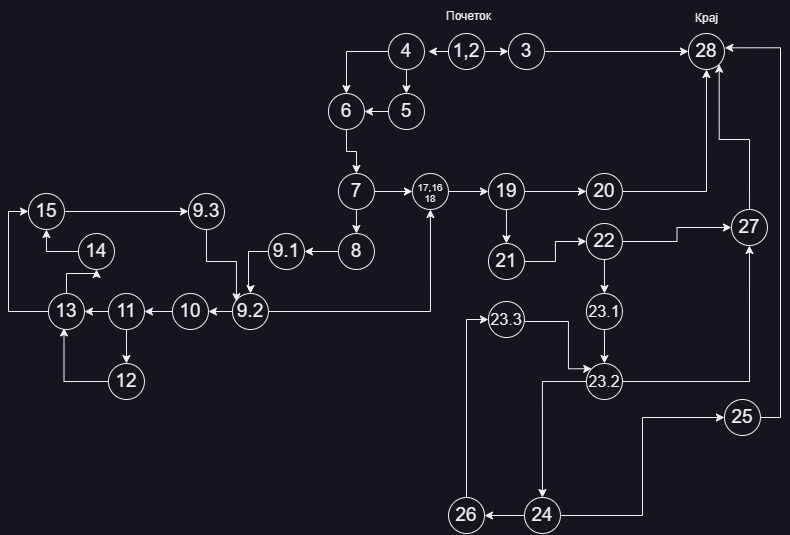
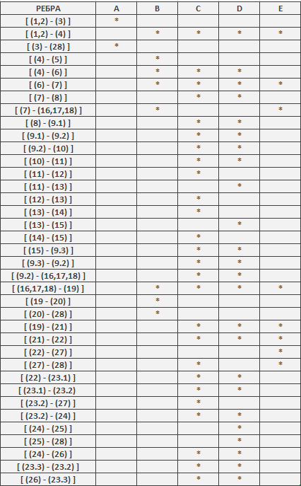

## Втора лабораториска задача по СИ - Живче Глигоров 216139 <br>
> **1.Control Flow Graph** <br>
>   

<hr></hr>

> **2.Цикломатската комплексност** <br>
> Согласно 1. постојат 10 predicate nodes : (1,2), (4), (7), (9.2), (11), (13), (19), (22), (23.2), (24) ; <br>
> Согласно формулата: Цикломатската комплексност = број на предикатни јазли + 1 <br>
> Цикломатската комплексност = 11 <br>

<hr></hr>


> **3. Every-branch** <br>
> ```
> A =  SILab2.function(null, new ArrayList<>())  
> B =  SILab2.function(new User("kalu", "kalu123", "kalugmailcom"), new ArrayList<>()) 
> C =  SILab2.function(new User("kalu", "kafanskapjevacica", "kalu.dragoliev@gmail.com"), List.of(new User("kalu", "kafanskapjevacica", "kalu.dragoliev@gmail.com"))) 
> D =  SILab2.function(new User("kalu", "kafanskapjevacica@", "kalu.dragoliev@gmail.com"), List.of(new User("Predrag", "desambiosinoc", "predrag.petkov@gmail.com"))));
> E =  SILab2.function(new User("kalu", "kakosibre kakosibre", "kalugmailcom"), new ArrayList<>()));
> ````
> 
> - Првиот тест е наменет соодветно за exception-от за реброто 2 -> 3
> - Вториот тест е наменет соодветно за да не влези во  првиот for-loop-от, односно да отиде од јазол 7 во јазол 16,17,18 и соодветно ќе заврши во реброто 19 - > 20.
> - Третиот тест е наменет соодветно за да влези во првиот for-loop-от каде ќе ги помине ребрата 11 -> 12, 13 -> 14  ќе влези во вториот for-loop и соодветно ќе заврши во јазолот 27.
> - Четвртиот тест е наменет соодветно за да влези во првиот for-loop-от каде Нема да  ги помине ребрата 11 -> 12, 13 -> 14  ќе влези во вториот for-loop и соодветно ќе заврши во јазолот 25.
> - Петиот тест е наменет соодветно за да го помине реброто  22 -> 27, каде нема да го задоволи условот за дали password-от содржи празно место.
> ```
> class SILab2Test {
>
>   @Test
>   void exceptionTest() {
>       RuntimeException exception = assertThrows(RuntimeException.class, () -> {
>           SILab2.function(null, new ArrayList<>());
>       });
>       assertEquals("Mandatory information missing!", exception.getMessage());
>
>   }
>
>   @Test
>   void loopTest() {
>       assertFalse(SILab2.function(new User("kalu", "kalu123", "kalugmailcom"), new ArrayList<>()));
>        assertFalse(SILab2.function(new User("kalu", "kafanskapjevacica", "kalu.dragoliev@gmail.com"), List.of(new User("kalu", "kafanskapjevacica", "kalu.dragoliev@gmail.com"))));
>        assertTrue(SILab2.function(new User("kalu", "kafanskapjevacica@", "kalu.dragoliev@gmail.com"), List.of(new User("Predrag", "desambiosinoc", "predrag.petkov@gmail.com"))));
>        assertFalse(SILab2.function(new User("kalu", "kakosibre kakosibre", "kalugmailcom"), new ArrayList<>()));
>   }
> }
> ```

<hr></hr>

> **4. Multiple Condition**
> ```
> A =  SILab2.function(null, new ArrayList<>()) 
> B =  SILab2.function(new User("Predrag","Mitkov12345","predrag_mitkov@gmail.com"),new ArrayList<>());
> C =  SILab2.function(new User("Predrag",null,"predrag_mitkov@gmail.com"),new ArrayList<>());
> D=   SILab2.function(new User("Predrag","Mitkov12345",null),new ArrayList<>());
> ````
 | | A | 	B | C | D |
 | :---------- | ---------- |   ---------- | ---------- |   ---------- | 
 | T X X |	* |  |	 | |
 | F F F	|	  | * | | |
 | F T X	|  |  | * | |
 | F F T	|  |	 | | * |
 
 
 **Доколку во поле се сретне _X_ тоа означува дека таа комбинација не е битна, односно може да биде Т или F.**
> ```
> @Test
>    void  multipleConcitionTestV1(){
>        RuntimeException exception=assertThrows(RuntimeException.class, ()->{
>            SILab2.function(null,new ArrayList<>());
>        });
>        assertEquals("Mandatory information missing!", exception.getMessage());
>
>    }
>    @Test
>    void  multipleConcitionTestV2(){
>        assertDoesNotThrow(()->{
>            SILab2.function(new User("Predrag","Mitkov12345","predrag_mitkov@gmail.com"),new ArrayList<>());
>        });
>    }
>
>    @Test
>    void multipleConcitionTestV3(){
>        RuntimeException exception=assertThrows(RuntimeException.class, ()->{
>            SILab2.function(new User("Predrag",null,"predrag_mitkov@gmail.com"),new ArrayList<>());
>        });
>        assertEquals("Mandatory information missing!", exception.getMessage());
>    }
>    @Test
>    void  multipleConcitionTestV4(){
>        RuntimeException exception=assertThrows(RuntimeException.class, ()->{
>            SILab2.function(new User("Predrag","Mitkov12345",null),new ArrayList<>());
>        });
>        assertEquals("Mandatory information missing!", exception.getMessage());
>    }
> ````

<hr></hr>
